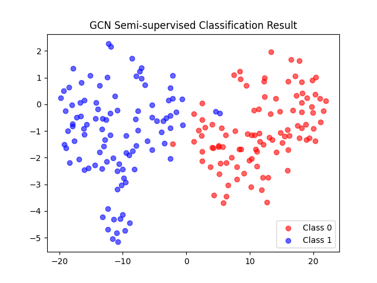
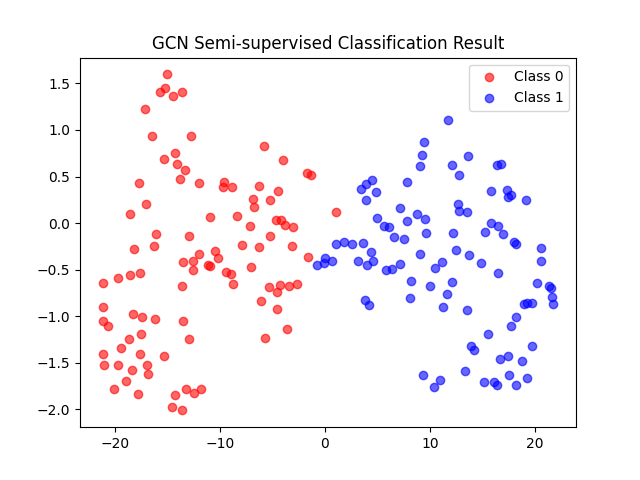
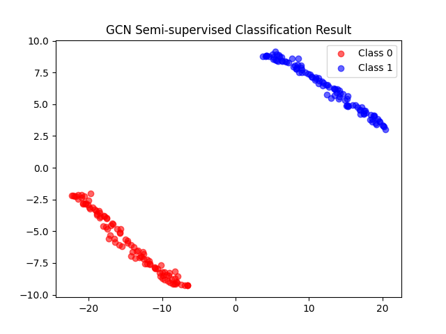
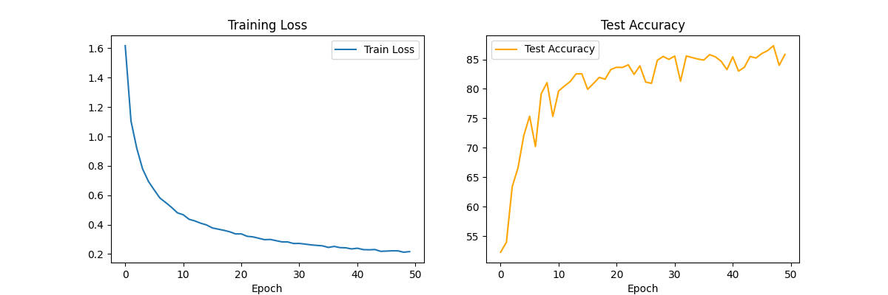
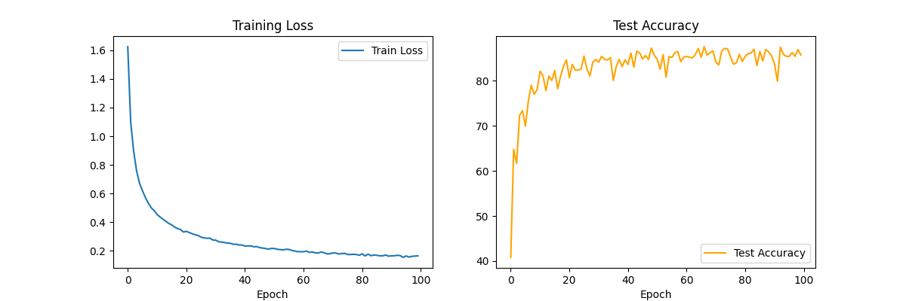
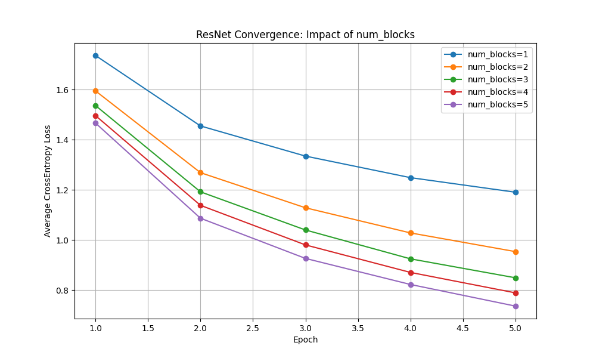

# 基于兴趣的GCN和ResNet论文复现学习记录
## GCN (一周)

### 一、起源
- 在课上接触到深度学习的算法
- 实验室面试提到深度学习有关论文复现的问题
- 试图找一篇论文复现深度学习相关算法

### 二、论文
- Semi-Supervised Classification with Graph Convolutional Networks (ICLR 2017)
- [论文链接](https://arxiv.org/abs/1609.02907)
- 问题：英语水平不够，只能读懂大致意思，不得要领
- 解决：用Gemini等AI大模型进行辅助学习和翻译，下面是我对此论文的理解：

1.  FAST APPROXIMATE CONVOLUTIONS ON GRAPHS （快速卷积在图上应用）
- 公式：$$H^{(l+1)} = \sigma \left( \tilde{D}^{-\frac{1}{2}} \tilde{A} \tilde{D}^{-\frac{1}{2}} H^{(l)} W^{(l)} \right)$$
- 初始的图卷积定义为：$$g_{\theta} \star x = U g_{\theta}(\Lambda) U^T x$$
 $U$：$L$ 的特征向量矩阵（傅里叶基）。
 $g_{\theta}(\Lambda)$：卷积核，可以看作是对特征值（频率）的函数。
- 采用ChebNet不等式来近似卷积，并进行一阶近似，他假设 $K=1$（只看 1 阶邻居），并令最大特征值 $\lambda_{max} \approx 2$
 公式简化为$$g \star x \approx \theta_0 x + \theta_1 (D^{-\frac{1}{2}} A D^{-\frac{1}{2}}) x$$
- 重正化 $$\tilde{A} = A + I_N, \quad \tilde{D}_{ii} = \sum_j \tilde{A}_{ij}$$
可得：$$\hat{A} = \tilde{D}^{-\frac{1}{2}} \tilde{A} \tilde{D}^{-\frac{1}{2}}$$
- PS:A为邻接矩阵，也就是每个节点收到邻居的影响，而不是最初单独的存在,D为度矩阵，每个节点的度为列之和
- 下面为代码复现
``` python
 import numpy as np
  # 1. 定义原始邻接矩阵 A (假设 3 个节点，0-1, 1-2 相连)
  A = np.array([
      [0, 1, 0],
      [1, 0, 1],
      [0, 1, 0]
  ], dtype=float)
    
  # 2. Renormalization Trick: 加上自环 (Self-loop)
  # A_tilde = A + I#如果不加单位阵，模型在聚合邻居特征时会丢掉节点自身的特征
  I = np.eye(3) #生成单位矩阵 np.eye 3为维度
  A_tilde = A + I
    
  # 3. 计算度矩阵 D_tilde (每个节点的度是行/列之和)
  # D_tilde 是一个对角矩阵
  d = np.sum(A_tilde, axis=1)#1为列和 0为行和
  D_tilde = np.diag(d)#以d这个向量作为对角线构建矩阵
    
  # 4. 计算对称归一化项: D_tilde^{-1/2}
  # 即对角线元素的 -0.5 次方
  D_inv_sqrt = np.diag(np.power(d, -0.5))
    
  # 5. 最终得到 GCN 的传播矩阵: \hat{A} = D^{-1/2} * A_tilde * D^{-1/2}
  # 这里的乘法是矩阵乘法
  A_hat = D_inv_sqrt @ A_tilde @ D_inv_sqrt
    
  print("原始 A:\n", A)
  print("\n加上自环后的 A_tilde:\n", A_tilde)
  print("\n最终归一化后的 A_hat:\n", np.round(A_hat, 3))
```

2. 两层的 GCN 模型用于半监督分类
- 论文中公式：$$Z = f(X, A) = \text{softmax} \left( \hat{A} \cdot \text{ReLU} \left( \hat{A} X W^{(0)} \right) W^{(1)} \right)$$
- 第一层（Hidden Layer）：线性变换：$X W^{(0)}$。将输入特征从 $F$ 维降到隐藏层维度 $H$（论文中通常取 16）。图卷积（邻居聚合）：$\hat{A} \times (X W^{(0)})$。每个节点吸纳邻居的信息。非线性激活：通过 $\text{ReLU}$ 函数。
- 第二层（Output Layer）：重复卷积：再次乘以 $\hat{A}$，这意味着信息传播到了 2-hop（两步以外）的邻居。维度映射：通过 $W^{(1)}$ 将特征映射到类别数 $C$。
- 分类层（Softmax）：对每一行（每个节点）做 Softmax，得到属于每个类别的概率。
- 模型每层只使用单个权重矩阵，并通过对邻接矩阵的适当归一化处理不同节点度

3. GCN算法的实现：使用pyTorch
```python
    import torch
    import torch.nn as nn
    import torch.nn.functional as F

    class GraphConvolution(nn.Module):#在 PyTorch 中，所有的神经网络层都要继承 nn.Module继承它之后，系统会自动帮你处理反向传播（BP）、参数更新和模型保存等底层繁琐工作
        def __init__(self, in_features, out_features):#W的特征维度
            super(GraphConvolution, self).__init__()#找到GC的父类转换对象
            # 对应公式中的 W
            self.weight = nn.Parameter(torch.FloatTensor(in_features, out_features))
            nn.init.xavier_uniform_(self.weight)#论文中提到的Glorot 初始化，它通过数学手段让每一层输出的方差保持一致，防止训练初期梯度爆炸
        #前向传播
        def forward(self, x, adj):
            # 对应公式: A_hat * X * W
            support = torch.mm(x, self.weight)
            output = torch.spmm(adj, support) # 稀疏矩阵乘法？
            return output
        #x：节点特征矩阵 $X$（形状：$N \times \text{in\_features}$）。
        # adj：预处理好的归一化邻接矩阵 $\hat{A}$（形状：$N \times N$）。
        # torch.mm：标准的稠密矩阵乘法（Matrix Multiplication）。
        # torch.spmm：稀疏矩阵乘法（Sparse Matrix Multiplication）。
        # 重点：因为 $\hat{A}$ 绝大多数位置都是 0，直接用普通矩阵乘法会极其浪费内存。spmm 只计算非零项，这是复现大图数据的关键。
        
```
- 对于 self.weight = nn.Parameter(torch.FloatTensor(in_features, out_features))
- torch.FloatTensor(in_features, out_features)创建空张量Tensor
- nn.Parameter(...)把矩阵包装到模型中
```python
import torch.nn as nn
import torch.nn.functional as F

class GCN(nn.Module):
    def __init__(self, nfeat, nhid, nclass, dropout):
        """
        nfeat: 输入特征维度 (Cora 是 1433)
        nhid:  隐藏层维度 (论文推荐 16)
        nclass: 类别数 (Cora 是 7)
        dropout: 失活率 (论文推荐 0.5)
        """
        super(GCN, self).__init__()

        # 定义两个图卷积层
        self.gc1 = GraphConvolution(nfeat, nhid)
        self.gc2 = GraphConvolution(nhid, nclass)
        
        # 定义 Dropout 率
        self.dropout = dropout

    def forward(self, x, adj):
        # 第一层卷积
        # 计算: A_hat * X * W1
        x = self.gc1(x, adj)
        
        # 激活函数: 增加非线性表达能力
        x = F.relu(x)
        
        # Dropout: 随机丢弃 50% 的神经元防止过拟合
        # 注意: training=self.training 是关键，测试时会自动关闭 Dropout
        x = F.dropout(x, self.dropout, training=self.training)
        
        # 第二层卷积
        # 计算: A_hat * H * W2 (此时输入是隐藏层特征 H)
        x = self.gc2(x, adj)
        
        # 输出层: 使用 log_softmax
        # 配合 NLLLoss (Negative Log Likelihood Loss) 使用，效果等同于 CrossEntropy
        return F.log_softmax(x, dim=1)
```
- Relu进行非线性，扩充模型学习复杂的能力
- https://github.com/tkipf/gcn/tree/master/gcn/data 在这里找到了相关的数据集

### 三、复现论文代码
基于我们刚刚已经完成了GCN算法的实现，即该公式$$Z = f(X, A) = \text{softmax} \left( \hat{A} \cdot \text{ReLU} \left( \hat{A} X W^{(0)} \right) W^{(1)} \right)$$
将结果又应用dropout防止过拟合，下一步将官方的数据集提供的数据进行图的组合并结合论文中给出的数据进行代码复现
组合起来代码如下：
```python
import torch
import torch.nn as nn
import torch.nn.functional as F
import torch.optim as optim
import numpy as np
import scipy.sparse as sp
import pickle as pkl
import networkx as nx
import sys


# --- 1. 数据加载与预处理 (Planetoid 格式) ---

def parse_index_file(filename):
    """读取测试集索引"""
    index = []
    for line in open(filename):
        index.append(int(line.strip()))
    return index


def load_data(dataset_str):
    """从原始文件加载拼图"""
    names = ['x', 'y', 'tx', 'ty', 'allx', 'ally', 'graph']
    objects = []
    for i in range(len(names)):
        with open("ind.{}.{}".format(dataset_str, names[i]), 'rb') as f:
            if sys.version_info > (3, 0):
                objects.append(pkl.load(f, encoding='latin1'))
            else:
                objects.append(pkl.load(f))

    x, y, tx, ty, allx, ally, graph = tuple(objects)
    test_idx_reorder = parse_index_file("ind.{}.test.index".format(dataset_str))
    test_idx_range = np.sort(test_idx_reorder)

    # 核心拼图逻辑
    features = sp.vstack((allx, tx)).tolil()
    features[test_idx_reorder, :] = features[test_idx_range, :]

    adj = nx.adjacency_matrix(nx.from_dict_of_lists(graph))

    # 标签处理: One-hot 转为类别索引
    labels = np.vstack((ally, ty))
    labels[test_idx_reorder, :] = labels[test_idx_range, :]

    # 划分数据集索引
    idx_train = range(len(y))
    idx_val = range(len(y), len(y) + 500)
    idx_test = test_idx_range

    return adj, features, labels, idx_train, idx_val, idx_test


def normalize_adj(adj):
    """A_hat = D^-1/2 * (A + I) * D^-1/2"""
    adj = sp.coo_matrix(adj)
    adj_tilde = adj + sp.eye(adj.shape[0])
    rowsum = np.array(adj_tilde.sum(1))
    d_inv_sqrt = np.power(rowsum, -0.5).flatten()
    d_inv_sqrt[np.isinf(d_inv_sqrt)] = 0.
    D_inv_sqrt = sp.diags(d_inv_sqrt)
    return D_inv_sqrt.dot(adj_tilde).dot(D_inv_sqrt).tocoo()


def sparse_to_tuple(sparse_mx):
    """将 scipy 稀疏矩阵转为 torch 稀疏张量"""
    sparse_mx = sparse_mx.tocoo().astype(np.float32)
    indices = torch.from_numpy(np.vstack((sparse_mx.row, sparse_mx.col)).astype(np.int64))
    values = torch.from_numpy(sparse_mx.data)
    shape = torch.Size(sparse_mx.shape)
    return torch.sparse.FloatTensor(indices, values, shape)


# --- 2. 模型定义 ---

class GraphConvolution(nn.Module):
    def __init__(self, in_features, out_features):
        super(GraphConvolution, self).__init__()
        self.weight = nn.Parameter(torch.FloatTensor(in_features, out_features))
        nn.init.xavier_uniform_(self.weight)

    def forward(self, x, adj):
        support = torch.mm(x, self.weight)
        output = torch.spmm(adj, support)
        return output


class GCN(nn.Module):
    def __init__(self, nfeat, nhid, nclass, dropout):
        super(GCN, self).__init__()
        self.gc1 = GraphConvolution(nfeat, nhid)
        self.gc2 = GraphConvolution(nhid, nclass)
        self.dropout = dropout

    def forward(self, x, adj):
        x = F.relu(self.gc1(x, adj))
        x = F.dropout(x, self.dropout, training=self.training)
        x = self.gc2(x, adj)
        return F.log_softmax(x, dim=1)


# --- 3. 运行主程序 ---

# 加载并预处理
adj, features, labels, idx_train, idx_val, idx_test = load_data('cora')
adj = sparse_to_tuple(normalize_adj(adj))
features = torch.FloatTensor(np.array(features.todense()))
labels = torch.LongTensor(np.where(labels)[1])  # 转为类别索引

idx_train = torch.LongTensor(idx_train)
idx_val = torch.LongTensor(idx_val)
idx_test = torch.LongTensor(idx_test)

# 初始化模型与优化器
model = GCN(nfeat=features.shape[1], nhid=16, nclass=int(labels.max()) + 1, dropout=0.5)
optimizer = optim.Adam(model.parameters(), lr=0.01, weight_decay=5e-4)


def train(epoch):
    model.train()
    optimizer.zero_grad()
    output = model(features, adj)
    loss_train = F.nll_loss(output[idx_train], labels[idx_train])
    loss_train.backward()
    optimizer.step()

    if epoch % 10 == 0:
        print(f'Epoch {epoch}: Loss {loss_train.item():.4f}')


# 训练 loop
for epoch in range(200):
    train(epoch)

# 测试结果
model.eval()
output = model(features, adj)
preds = output[idx_test].max(1)[1]
acc_test = preds.eq(labels[idx_test]).sum().item() / len(idx_test)
print(f"\nFinal Test Accuracy: {acc_test:.4f}") 
```
- 第一次运行结果如图（cora）数据集
- 
- 对应论文结果如图
- 
- 由图可知该运行结果与论文结果相近
- citeseer数据集运行结果如图
- 运行时由于一些编码格式（类别索引（1D））和（0ne-hot）不同而维度出错，在AI帮助下修改代码运行成功
- 
- 由图可知该运行结果与论文结果相近
PS：一些值得关注的点:
- optimizer = optim.Adam(model.parameters(), lr=0.01, weight_decay=5e-4)
- 优化器用来优化W权重

### 四、应用
- 建模仿真: 构建 200 节点的合成拓扑图，模拟高内聚、低耦合的非欧几里得（Non-Euclidean）社交网络结构。
- 半监督学习: 在仅提供 5\% 标注数据的极端条件下，利用 GCN 的邻域聚合算子实现监督信号在图拓扑中的有效传播。
- 可视化分析: 使用 t-SNE 技术将高维节点表征降维至 2D 空间，验证了模型在隐空间中的聚类一致性，并改变标注数据占比多次实验
- 5%标签运行结果如图
- 
- 10%标签运行结果如图
- 
- 可见标签占比越高，运行结果越好
- 在模型中采用的是论文的两层GCN模型，增加层数到10层，发现报错，增加层数到8层结果如图
- 
- 可见出现了过平滑现象，由于层数过多，导致样本特征趋于归一化，那么如何解决过平滑现象呢？

## ResNet 
### 一、起源
- 在对于GCN的研究时发现出现了过平滑现象，网络层数过深，过度迭代聚合，图的链接过于稠密
- 其中的一种解决方法就是ResNet,于是我开始进行第二篇论文的复现和研究
### 二、论文
- Deep Residual Learning for Image Recognition
- [论文链接](https://arxiv.org/pdf/1512.03385)
### 三、复现论文代码
-  核心原理：残差块，代码复现如下：
```python
import torch
import torch.nn as nn
import torch.nn.functional as F

class BasicBlock(nn.Module):
    def __init__(self, in_planes, planes, stride=1):
        super(BasicBlock, self).__init__()
        # 主路径第一层
        self.conv1 = nn.Conv2d(in_planes, planes, kernel_size=3, stride=stride, padding=1, bias=False)
        self.bn1 = nn.BatchNorm2d(planes)
        # 主路径第二层
        self.conv2 = nn.Conv2d(planes, planes, kernel_size=3, stride=1, padding=1, bias=False)
        self.bn2 = nn.BatchNorm2d(planes)

        # 捷径 (Shortcut)
        self.shortcut = nn.Sequential()
        # 如果维度不匹配，执行 Option B (投影映射)
        if stride != 1 or in_planes != planes:
            self.shortcut = nn.Sequential(
                nn.Conv2d(in_planes, planes, kernel_size=1, stride=stride, bias=False),
                nn.BatchNorm2d(planes)
            )

    def forward(self, x):
        # H(x) = ReLU( F(x) + x )
        out = F.relu(self.bn1(self.conv1(x)))
        out = self.bn2(self.conv2(out))
        out += self.shortcut(x) # 核心加法
        out = F.relu(out)
        return out

```
- 为什么会出现步长和通道数改变的情况
- 在 ResNet 论文的 Table 1 中，可以看到这种“翻倍”是非常规整的：$16 \to 32 \to 64$（CIFAR-10 版）
-  nn.Conv2d核心计算逻辑:
-  $$Y(i, j) = \sum_{m=0}^{k-1} \sum_{n=0}^{k-1} X(i+m, j+n) \cdot W(m, n)$$
- 如果你想要 16 个输出通道，系统就会准备 $16 \times 3 = 48$ 个不同的 $3 \times 3$ 卷积核。每一组（3个）负责生成一个输出通道。ResNet 论文中的参数量计算：如果一层是 nn.Conv2d(16, 32, 3)，那么这一层的权重参数数量是：$$32 \times 16 \times (3 \times 3) = 4,608 \text{ 个参数}$$
- 输出尺寸计算公式：
- $$L_{out} = \left\lfloor \frac{L_{in} + 2 \times \text{padding} - \text{kernel\_size}}{\text{stride}} \right\rfloor + 1$$
- nn.BatchNorm2d:
- 由于深层网络面对问题;内部协变量偏移 (Internal Covariate Shift),而产生
- BN 的核心逻辑非常简单，分为四步。
- 假设输入是一个四维张量 $(N, C, H, W)$：计算均值 ($\mu$)：针对每一个通道，计算该 Batch 中所有像素点的平均值。计算方差 ($\sigma^2$)：计算这些像素点相对于均值的离散程度。
- 标准化 (Normalize)：$$\hat{x} = \frac{x - \mu}{\sqrt{\sigma^2 + \epsilon}}$$（其中 $\epsilon$ 是一个极小的数，防止除以零）。此时，数据变成了均值为 0、方差为 1 的标准分布。仿射变换 (Scale & Shift)：这是最精妙的一步。
- $$y = \gamma \hat{x} + \beta$$网络会学习两个参数 $\gamma$（缩放）和 $\beta$（平移）。如果网络觉得“标准分布”不好，它可以通过学习让数据回到最适合激活函数的分布。
- 卷积核的来源：
- nn.Conv2d(3, 16, kernel_size=3)pytorch初始化算法提供卷积核
- 卷积核通过损失函数Loss和反向传播和优化器不断进化
- nn.sequential():将多个函数进行打包包装
- 我们已经完成了残差块的创建，接下来进行ResNet核心代码的复现，代码如下：
```python
class ResNet(nn.Module):
    def __init__(self, block, num_blocks, num_classes=10):
        super(ResNet, self).__init__()
        self.in_planes = 16 # CIFAR-10 论文起步是 16 通道

        # 第一层：3x3 卷积
        self.conv1 = nn.Conv2d(3, 16, kernel_size=3, stride=1, padding=1, bias=False)
        self.bn1 = nn.BatchNorm2d(16)
        
        # 论文中的三个阶段
        # Stage 1: 输出 32x32, 16通道
        self.layer1 = self._make_layer(block, 16, num_blocks[0], stride=1)
        # Stage 2: 输出 16x16, 32通道
        self.layer2 = self._make_layer(block, 32, num_blocks[1], stride=2)
        # Stage 3: 输出 8x8, 64通道
        self.layer3 = self._make_layer(block, 64, num_blocks[2], stride=2)
        
        # 最后的池化和分类
        self.linear = nn.Linear(64, num_classes)

    def _make_layer(self, block, planes, num_blocks, stride):
        strides = [stride] + [1]*(num_blocks-1)
        layers = []
        for s in strides:
            layers.append(block(self.in_planes, planes, s))
            self.in_planes = planes
        return nn.Sequential(*layers)

    def forward(self, x):
        out = F.relu(self.bn1(self.conv1(x)))
        out = self.layer1(out)
        out = self.layer2(out)
        out = self.layer3(out)
        out = F.avg_pool2d(out, 8) # 全局平均池化
        out = out.view(out.size(0), -1)
        out = self.linear(out)
        return out

# 实例化一个 ResNet-20 (n=3, 层数 = 6*3 + 2 = 20)
def resnet20():
    return ResNet(BasicBlock, [3, 3, 3])
```
- nn.linear:
- 是网络的最后一层，也成为分类层或全连接层
- 在 ResNet 的最后一个卷积阶段（Stage 3），输出的特征图维度通常是：$$[Batch\_Size, 64, 8, 8]$$（即 64 个通道，每个通道是 $8 \times 8$ 的矩阵）。
- 全局平均池化 (GAP)：F.adaptive_avg_pool2d(out, (1, 1)) 会把每个 $8 \times 8$ 的矩阵取平均值，变成一个数字。输出维度变为：$[Batch\_Size, 64, 1, 1]$
- 展平 (View/Flatten)：out.view(out.size(0), -1) 把维度变成 $[Batch\_Size, 64]$。
- nn.Linear：这本质上是一个矩阵乘法 $y = xA^T + b$。输入：64 维向量（代表 64 种高级抽象特征）。输出：num_classes 维向量（例如 CIFAR-10 是 10 维，代表 10 个类别的得分/Logits）。
- _make_layer不断调整维度
- 为什么要全局平均池化
- 剧烈减少参数量，防止过拟合，增强特征与类别的语义对应，允许输入任意尺寸的图像，空间稳健性（Robustness）
- 那么通常应该怎么训练一个神经网络呢？
1. 损失函数 (Loss Function)对于图像分类任务，最标准的选择是 交叉熵损失（Cross Entropy Loss）。逻辑： 它衡量模型预测的概率分布与真实标签（One-hot 编码）之间的距离。公式：$$L = -\sum_{i=1}^{n} y_i \log(\hat{y}_i)$$直观理解： 如果模型对正确类别的预测概率越接近 1，损失就越小；反之，损失会呈指数级增长。
2. 优化器 (Optimizer)优化器决定了模型如何根据梯度更新参数。SGD + Momentum（随机梯度下降 + 动量）： 视觉领域的经典选择。加入动量（通常设为 0.9）就像让小球下坡时带有惯性，能冲出局部最小值。Adam / AdamW： 自动调节每个参数的学习率，上手容易，收敛快，但在某些视觉任务上最终泛化效果可能略逊于精调后的 SGD。权重衰减 (Weight Decay)： 也就是 $L_2$ 正则化，通常设为 $1e-4$ 或 $5e-4$，用来防止参数过大，起到平滑模型的作用。
3. 学习率策略 (Learning Rate Scheduler)学习率（LR）是训练中最重要的超参数。初始 LR： 通常设为 0.1（配合 SGD）或 0.001（配合 Adam）。衰减计划：Step Decay： 每隔 30 个 epoch 把学习率降低到原来的 1/10。Cosine Annealing（余弦退火）： 让学习率按余弦曲线平滑下降，目前非常流行，因为它能让模型在训练后期更稳定。Warm-up（预热）： 在训练前几个 epoch 先用极小的学习率，防止梯度爆炸。
4. 数据增强 (Data Augmentation)为了让模型不“读死书”，我们需要在训练时对图片做随机变换：基础组合： 随机裁剪 (RandomResizedCrop) + 水平翻转 (HorizontalFlip)。高级技巧： * Mixup： 把两张图片按比例“叠印”在一起。AutoAugment： 让 AI 自动学习最适合这套数据的增强方案。
- 回到论文，我们已经完成了残差块和ResNet核心代码的复现，接下来是如何运用以及对于数据集的处理
- 代码如下
```python
# --- 2. 训练配置 ---
device = 'cuda' if torch.cuda.is_available() else 'cpu'#优先使用NVIDIA GPU (CUDA)
best_acc = 0#用于记录训练过程中最高准确率
start_epoch = 0#起始轮数

# 数据增强 (论文核心：Padding + Crop)
transform_train = transforms.Compose([
    transforms.RandomCrop(32, padding=4),#随机裁剪
    transforms.RandomHorizontalFlip(),#随机水平翻转
    transforms.ToTensor(),#转为张量并归一化到 [0, 1]
    transforms.Normalize((0.4914, 0.4822, 0.4465), (0.2023, 0.1994, 0.2010)),
#Normalize： 这里的均值和标准差是 CIFAR-10 全局计算出的经验值。它能将像素值分布调整到 0 附近，加速神经网络收敛。
transform_test = transforms.Compose([
    transforms.ToTensor(),
    transforms.Normalize((0.4914, 0.4822, 0.4465), (0.2023, 0.1994, 0.2010)),
])

trainset = torchvision.datasets.CIFAR10(root='./data', train=True, download=True, transform=transform_train)
trainloader = torch.utils.data.DataLoader(trainset, batch_size=128, shuffle=True, num_workers=2)

testset = torchvision.datasets.CIFAR10(root='./data', train=False, download=True, transform=transform_test)
testloader = torch.utils.data.DataLoader(testset, batch_size=100, shuffle=False, num_workers=2)

net = resnet20().to(device)
criterion = nn.CrossEntropyLoss()
# 论文配置：SGD + Momentum + Weight Decay
optimizer = optim.SGD(net.parameters(), lr=0.1, momentum=0.9, weight_decay=1e-4)
# 学习率调整：在总进度的 50% 和 75% 处下降
scheduler = optim.lr_scheduler.MultiStepLR(optimizer, milestones=[100, 150], gamma=0.1)

# 用于存储统计数据以便绘图
history = {'train_loss': [], 'test_acc': []}
```
- 数据加载完成后，最后一部分是训练该模型
- 代码如下:
```python
# --- 3. 训练与验证函数 ---
def train(epoch):
    net.train()#告诉模型处于训练模式
    train_loss = 0
    correct = 0
    total = 0#从数据集中读取图片数据和标签
    for batch_idx, (inputs, targets) in enumerate(trainloader):
        inputs, targets = inputs.to(device), targets.to(device)
        optimizer.zero_grad()
        outputs = net(inputs)#前向传播
        loss = criterion(outputs, targets)
        loss.backward()#反向传播
        optimizer.step()#更新模型中权重

        train_loss += loss.item()#将张量转换为数值
        _, predicted = outputs.max(1)#返回最大值和最大值的索引1，我们只要第二个也就是类别
        total += targets.size(0)
        correct += predicted.eq(targets).sum().item()
#逐个对比预测值和真实值，相同为 True，不同为 False。
    avg_loss = train_loss / (batch_idx + 1)
    history['train_loss'].append(avg_loss)
    print(f'Epoch {epoch}: Loss: {avg_loss:.3f} | Acc: {100. * correct / total:.3f}%')


def test(epoch):
    global best_acc
    net.eval()#评估模式
    test_loss = 0
    correct = 0
    total = 0
    with torch.no_grad():
        for batch_idx, (inputs, targets) in enumerate(testloader):
            inputs, targets = inputs.to(device), targets.to(device)
            outputs = net(inputs)
            _, predicted = outputs.max(1)
            total += targets.size(0)
            correct += predicted.eq(targets).sum().item()

    acc = 100. * correct / total
    history['test_acc'].append(acc)
    print(f'Test Acc: {acc:.3f}%')


# --- 4. 执行训练与可视化 ---
epochs = 200  # 论文中大约是 64k iterations
for epoch in range(start_epoch, start_epoch + epochs):
    train(epoch)
    test(epoch)
    scheduler.step()
```
- with torch.no_grad():
- 改变的是后台的内存管理。它关闭了梯度记录器。防止显存堆积太多而爆炸
- 运行报错
*** line 140, in _check_not_importing_main
    raise RuntimeError('''
RuntimeError: 
        An attempt has been made to start a new process before the
        current process has finished its bootstrapping phase. This probably means that you are not using fork to start your
        child processes and you have forgotten to use the proper idiom
        in the main module:
- 解决：将运行程序的主代码放进if __name__ == '__main__':中
- 可视化代码如下：
```python
 # 绘制结果
    plt.figure(figsize=(12, 4))
    plt.subplot(1, 2, 1)
    plt.plot(history['train_loss'], label='Train Loss')
    plt.title('Training Loss')
    plt.xlabel('Epoch')
    plt.legend()

    plt.subplot(1, 2, 2)
    plt.plot(history['test_acc'], label='Test Accuracy', color='orange')
    plt.title('Test Accuracy')
    plt.xlabel('Epoch')
    plt.legend()
    plt.show()
```
运行特别慢
由于时间过长，我们修改epoch数目为50，即运行50轮，发现时间依旧很慢，与期待的时间不符

### 四、优化和应用
- 运行速度过慢的问题
- 解决方案一：优化DataLoader:
```python
# 修改前
trainloader = torch.utils.data.DataLoader(trainset, batch_size=128, shuffle=True)

# 修改
trainloader = torch.utils.data.DataLoader(
    trainset, 
    batch_size=128, 
    shuffle=True, 
    num_workers=4,      # 根据你的 CPU 核心数调整，Windows 建议 2-4
    pin_memory=True     # 加速数据拷贝到显存
) 
```
- 解决方案二：调整batch_siz数
- 出现错误
*** UserWarning: 'pin_memory' argument is set as true but no accelerator is found, then device pinned memory won't be used.
  super().__init__(loader)
- 方法：把所有运行程序放在if __name__ == '__main__':中
- 发现时间依旧较长检测是否用显卡
- 输出Using device: cpu
- 一直都在用cpu运行！！所以特别慢！如梦方醒！)
- 解决方法：去nvidia官网下载显卡驱动,并安装支持GPU的pytorch
- 重新安装后速度大为提升，跑十轮的速度和之前跑一轮的速度相同，运行50轮结果如下：

-运行100轮结果如下：


- 若改变残差块的数目会出现什么？
- 
- 由此可见，残差块在小范围内增加会显著降低损失函数，提高准确率，10以上尚未尝试

## 总结
1. ResNet 改变了学习目标。它让网络学习的是残差（Residual），即特征的变化量，而非原始映射。这使得模型在初始化为接近恒等映射时，更容易优化
2. 梯度消失通过 BN 层已经解决了一部分，ResNet 主要是为了解决深层网络的训练误差反而高于浅层网络的“退化”现象
3. 频谱域的简化： GCN 的精髓在于将复杂的谱卷积通过一阶切比雪夫多项式简化，最终演变成一个高效的局部空间聚合过程
4. 归一化技巧： 提到 Renormalization Trick（添加自环 $\tilde{A} = A + I$），这是防止特征在多层传递中规模爆炸或消失的关键